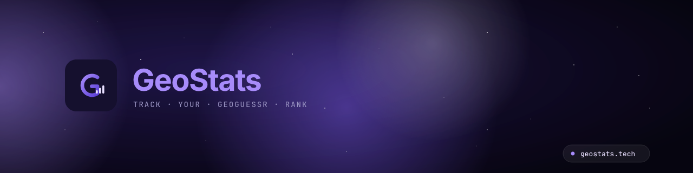

  

  &nbsp;
  &nbsp;
  

 

  📈 <strong>Daily rating snapshots</strong> — watch your rank grow (or cry about it) 
  🔮 <strong>Percentile forecast</strong> — see where you'll land tomorrow 
  👥 <strong>Doppelganger</strong> — find players at your exact skill level 
  🌍 <strong>Any player</strong> — look up anyone by nick, URL or ID

 

  <a href="https://geostats.tech" target="_blank" rel="noopener"><strong>→ geostats.tech</strong></a>

